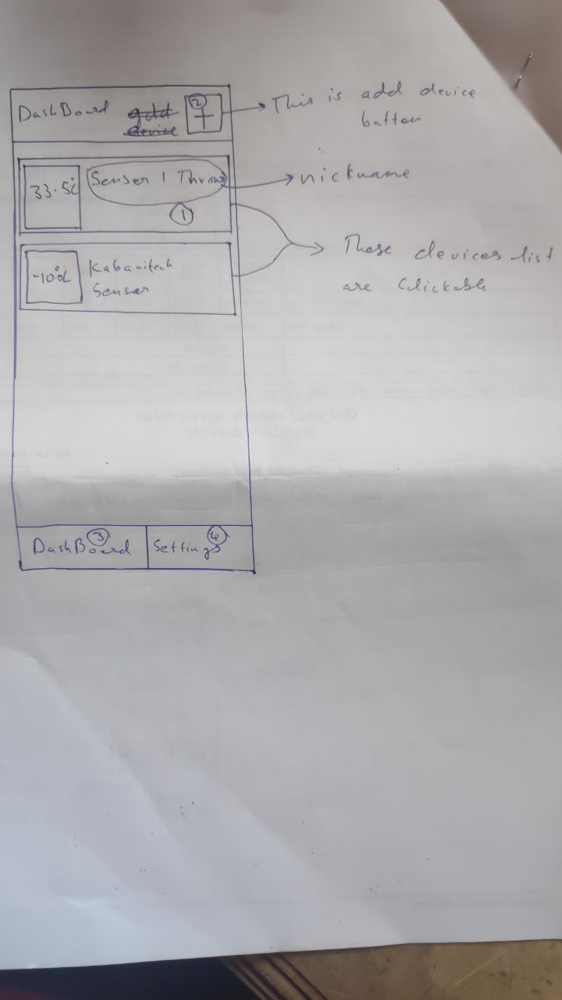
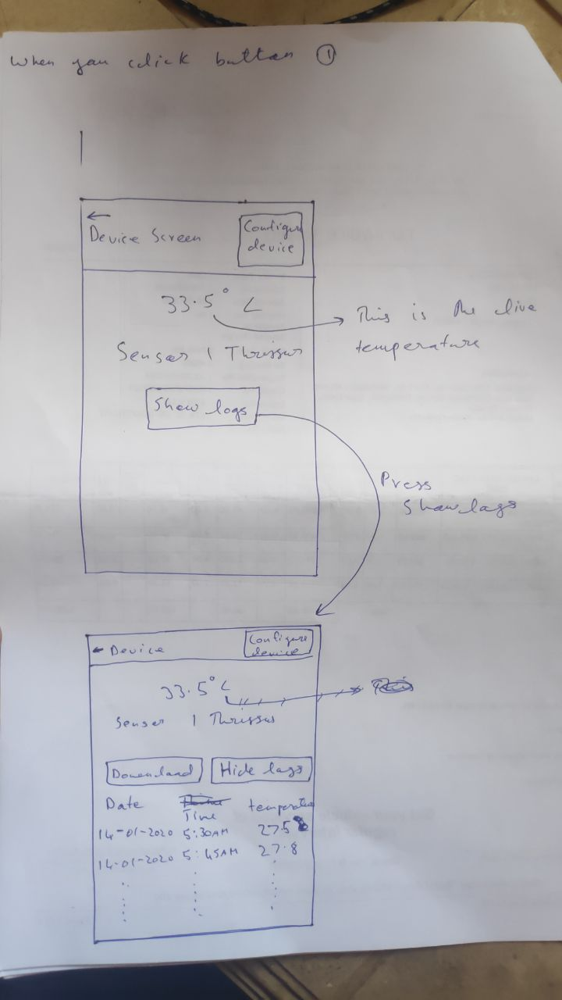
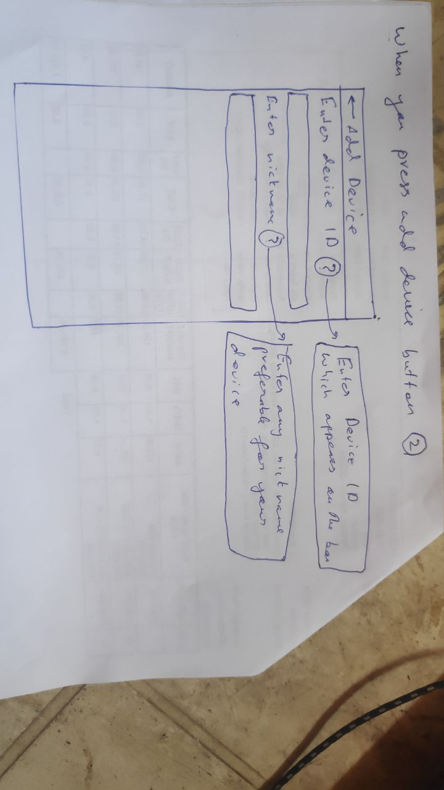
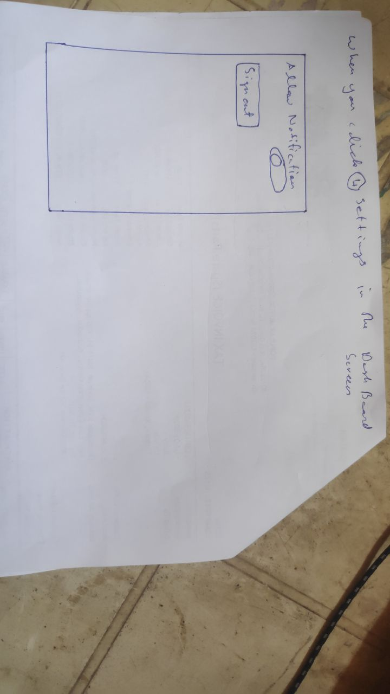
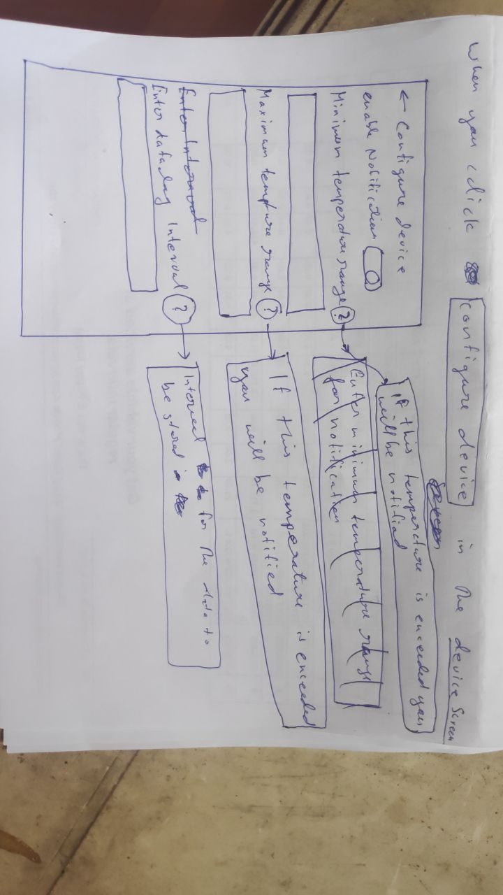

For testing you can add device in the add device screen. 
Enter device ID  --> 9544900804  
Enter Nickname --> (any nickname desirable)  

 
 
First screen
  

when you click button (1)  

 
When you click the slow logs a list showing logs appears in the same page providing two more options  
(1)---->[download]  
(2)--->[hide logs]  

 
 
When you press the Add Device(+) Button (2)  
  

When you click (4) settings in the dashboard screen   
  

When you click Configure device in the device screen  
  
